<div align="center">

# 👋 Welcome to my Cloud Journey!


</div>

---


### 🧑‍💻 About Me

```javascript
const sowjanya = {
    location: "Monheim am Rhein, Germany 🇩🇪",
    currentRole: "AWS Cloud Engineer (In Training)",
    education: "Digital Career Institute",
    
    previousLife: {
        field: "Biology & Education",
        experience: "8+ years teaching",
        transition: "2024 - Embarked on Cloud Journey"
    },
    
    certifications: [
        "AWS Cloud Practitioner ✅",
        "AWS Solutions Architect (In Progress) 🔄"
    ],
    
    languages: {
        spoken: ["English", "German (B2)", "Telugu", "Hindi"],
        programming: ["Python", "Bash", "YAML", "HCL"]
    },
    
    passions: [
        "☁️ Cloud Architecture",
        "🚀 DevOps & Automation", 
        "🔐 Security Best Practices",
        "📚 Continuous Learning"
    ]
};
```

<br clear="right"/>

---

### 🛠️ Technologies & Tools

<div align="center">

#### Cloud & Infrastructure


#### DevOps & Tools


#### Languages & Scripting


</div>

---

### 📈 Learning Progress

```mermaid
graph LR
    A[🎓 Biology Background] --> B[🌍 Moved to Germany]
    B --> C[📚 Language Learning]
    C --> D[☁️ AWS Training]
    D --> E[🏆 Cloud Practitioner]
    E --> F[🎯 Solutions Architect]
    F --> G[💼 Cloud Engineer Role]
    
    style A fill:#ff6b6b
    style B fill:#ffd93d
    style C fill:#6bcf7f
    style D fill:#4ecdc4
    style E fill:#ff9900
    style F fill:#95e1d3
    style G fill:#38ada9
```

<div align="center">



</div>

---

### 🎯 Current Focus Areas

<table>
<tr>
<td width="50%">

#### 🔥 Hot Topics
- AWS networking (VPC, Subnets, NAT)
- Security groups & IAM policies
- Infrastructure as Code
- CI/CD pipeline automation
- Container orchestration basics

</td>
<td width="50%">

#### 📚 Learning Queue
- Advanced Terraform modules
- Kubernetes fundamentals
- AWS Lambda & serverless
- Monitoring & observability
- Cost optimization strategies

</td>
</tr>
</table>

---

### 🏆 Achievements & Milestones

<div align="center">

| 🎖️ Achievement | 📅 Date | 📝 Details |
|:---:|:---:|:---|
| 🎓 Started DCI Course | Dec 2024 | AWS Solutions Architect Program |
| ⭐ AWS CCP Certified | July 2025 | Cloud Practitioner (CLF-C02) |
| 🌐 German B2 Level | 2024 | Language proficiency achieved |
| 🔄 Career Transition | 2024 | From Education to Cloud Engineering |

</div>

---

### 💼 Career Journey Timeline

```text
2012 ████████░░░░░░░░░░░░░░░░░░░░░░░░ Teaching Career
2019 ░░░░░░░░░░░░░░░░████░░░░░░░░░░░░ M.Sc. Microbiology (Distinction)
2021 ░░░░░░░░░░░░░░░░░░░░████░░░░░░░░ Relocated to Germany
2024 ░░░░░░░░░░░░░░░░░░░░░░░░████░░░░ Started AWS Journey
2025 ░░░░░░░░░░░░░░░░░░░░░░░░░░░░███► Cloud Engineering Career
```

---

### 🌟 Fun Facts

<div align="center">

🌍 **4 Languages Spoken** | 🎯 **Career Changer** | 📚 **Lifelong Learner** | 🏆 **Best Teacher Award Winner**

> *"From teaching biology to architecting clouds - because adaptation is evolution!"* 

</div>

---

### 📬 Connect With Me

<div align="center">

[](https://linkedin.com/in/sowjanya-vuriti)
[](mailto:sowjanyavuriti24@gmail.com)
[](https://svuritigit.github.io)
[](https://github.com/svuritigit)

</div>

---

<div align="center">

### ⚡ Quick Stats


### 💭 Quote of the Day


---


**✨ "Building the future, one cloud resource at a time" ✨**

*Last updated: January 2026*

</div>
